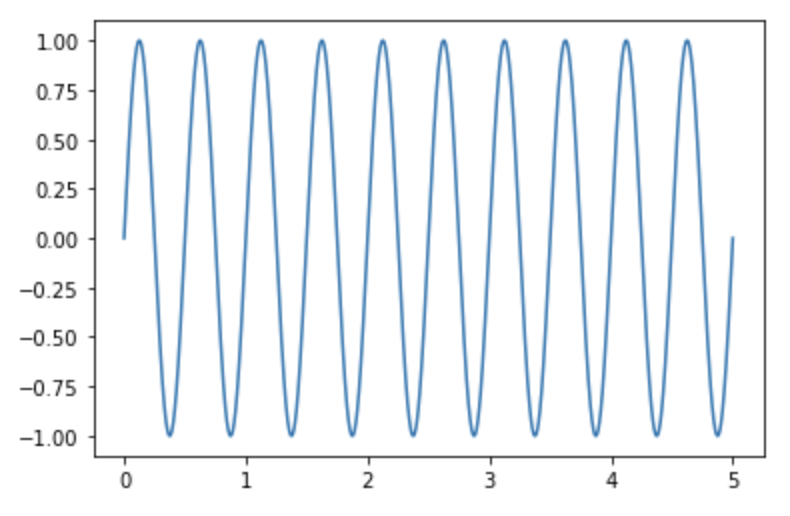
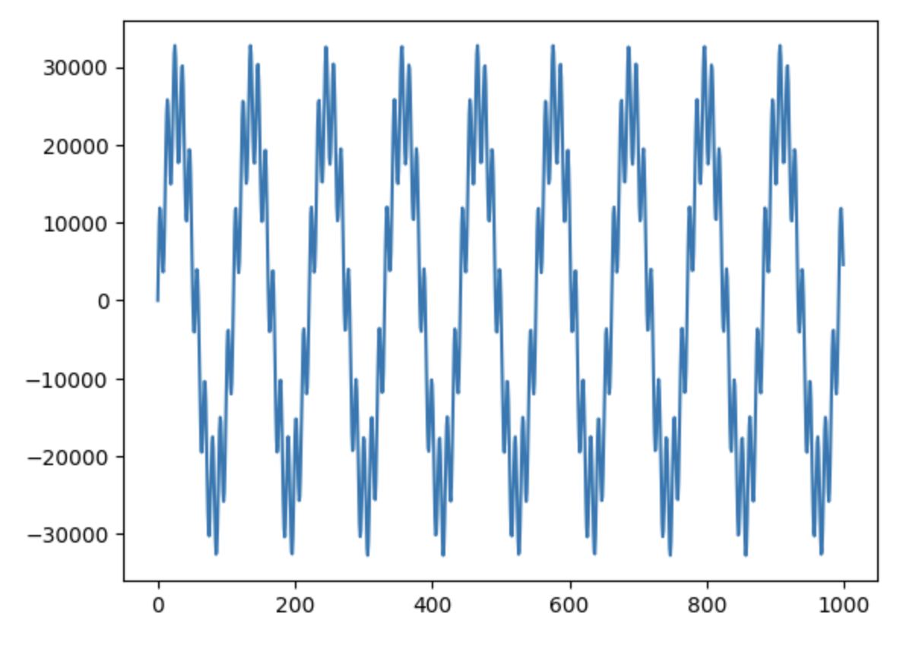

# Vibrations Simulator

|           |                                                                                                 |
| --------- | ----------------------------------------------------------------------------------------------- |
| Name      | Vibrations Simulator                                                                            |
| Version   | v1.0.1                                                                                          |
| DockerHub | [beetaone/vibrations-simulator](https://hub.docker.com/r/beetaone/vibrations-simulator) |
| Authors   | Jakub Grzelak                                                                                   |

- [Vibrations Simulator](#vibrations-simulator)
  - [Description](#description)
  - [Environment Variables](#environment-variables)
    - [Module Specific](#module-specific)
    - [Set by the beetaone Agent on the edge-node](#set-by-the-beetaone-agent-on-the-edge-node)
  - [Dependencies](#dependencies)
  - [Input](#input)
  - [Output](#output)

## Description

Simulate vibrations waveform data. Provide sample size, measurement duration and frequencies of the base waveforms.

## Environment Variables

### Module Specific

The following module configurations can be provided in a data service designer section on beetaone platform:

| Name                     | Environment Variables    | type    | Description                                                                                                              |
| ------------------------ | ------------------------ | ------- | ------------------------------------------------------------------------------------------------------------------------ |
| Sample Size              | SAMPLE_SIZE              | integer | Number of samples taken per second, sample rate of 1024 means that 1024 values of the signal are recorded in one second. |
| Measurement Duration     | MEASUREMENT_DURATION     | integer | How long (in seconds) the measurement period lasts and batches the data.                                                 |
| Main Frequency           | MAIN_FREQUENCY           | float   | Frequency of the main waveform (Hz).                                                                                     |
| Main Magnitude           | MAIN_MAGNITUDE           | float   | Magnitude of the main waveform.                                                                                          |
| Vibration Frequency      | VIBRATION_FREQUENCY      | float   | Frequency of the vibration waveform (Hz).                                                                                |
| Vibration Magnitude      | VIBRATION_MAGNITUDE      | float   | Magnitude of the vibration waveform.                                                                                     |
| Vibration Probability    | VIBRATION_PROBABILITY    | float   | Probability that the signal will start a vibration anomaly at this frequency during any time step.                       |
| Continue Probability     | CONTINUE_PROBABILITY     | float   | Probability that the signal will continue emitting noise at this frequency during any following timestep.                |
| Noise Standard Deviation | NOISE_STANDARD_DEVIATION | float   | Standard deviation of the noise of the composite signal, randomly generated from the normal distribution.                |
| Output Label             | OUTPUT_LABEL             | string  | The output label at which data is dispatched.                                                                            |

### Set by the beetaone Agent on the edge-node

Other features required for establishing the inter-container communication between modules in a data service are set by beetaone agent.

| Environment Variables | type   | Description                                   |
| --------------------- | ------ | --------------------------------------------- |
| MODULE_NAME           | string | Name of the module                            |
| MODULE_TYPE           | string | Type of the module (INGRESS, PROCESS, EGRESS) |
| EGRESS_URLS           | string | HTTP ReST endpoint for the next module        |

## Dependencies

```txt
requests
numpy
```

## Input

This module does not take any input.

## Output

Output of this module is bytes object containing compressed (LZMA compression) array of data points of a simulated waveform.



